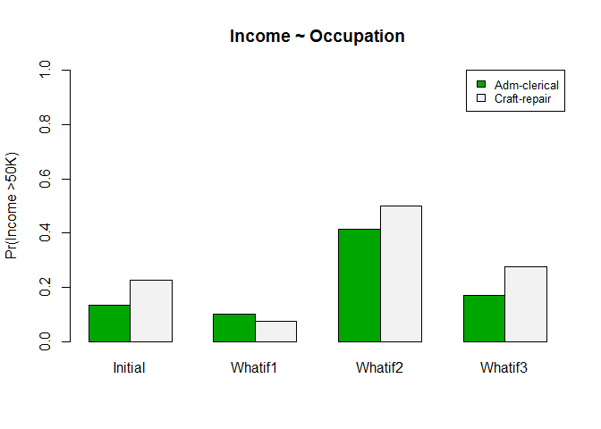

# Statistical adjustments in Redhyte
Toh Wei Zhong  
  

## Introduction

The current iteration of Redhyte works by stratification, in two steps: context mining and mined hypotheses formulation and scoring. Context mining refers to the process of searching for attributes in the dataset that may be interesting to consider, when they are used as context items for stratification.

One of the main objectives of Redhyte was to search for and deal with confounders. The other popular method for dealing with confounders, besides stratification, is statistical adjustment, i.e. including attributes that could confound in a linear model, together with the attributes of interest. For instance, if we are interested in lung cancer incidence and smoking status, we could build a model predicting lung cancer incidence, using smoking status and e.g. age or income as covariates.

The following proof of concept depicts a possible extension of Redhyte towards statistical adjustments. Concretely, the user had an initial test done in Redhyte. What we want to do is to *compare, after some form of adjustments, an additional test with the initial test.*

### Settings of POC

* We are using the adult dataset.
* Both the target and comparing attributes are categorical and binary. Recall that in Redhyte, we asked the user to stipulate target and comparing attributes to do an initial test. The target attribute could be either numerical or categorical, while the comparing attribute is strictly categorical. Here, we are only considering categorical target attributes.
* We assume context mining has been done, and we have shortlisted 5 attributes that are potentially interesting. They are sex, marital status, relationship, education, and workclass.
* The initial hypothesis: is there a difference in income (>50K or <= 50K) when comparing the samples on occupation between Adm-clerical and Craft-repair?

## Method
### Load dataset
Let's go. Start by loading dataset:

```r
df<-read.csv("C:/Users/Toh Wei Zhong/Documents/R/redhyte-lab/data/adult.txt",
             stringsAsFactors=T,sep=",")
str(df)
```

```
## 'data.frame':	32561 obs. of  15 variables:
##  $ age           : int  39 50 38 53 28 37 49 52 31 42 ...
##  $ workclass     : Factor w/ 9 levels " ?"," Federal-gov",..: 8 7 5 5 5 5 5 7 5 5 ...
##  $ fnlwgt        : int  77516 83311 215646 234721 338409 284582 160187 209642 45781 159449 ...
##  $ education     : Factor w/ 16 levels " 10th"," 11th",..: 10 10 12 2 10 13 7 12 13 10 ...
##  $ education.num : int  13 13 9 7 13 14 5 9 14 13 ...
##  $ marital.status: Factor w/ 7 levels " Divorced"," Married-AF-spouse",..: 5 3 1 3 3 3 4 3 5 3 ...
##  $ occupation    : Factor w/ 15 levels " ?"," Adm-clerical",..: 2 5 7 7 11 5 9 5 11 5 ...
##  $ relationship  : Factor w/ 6 levels " Husband"," Not-in-family",..: 2 1 2 1 6 6 2 1 2 1 ...
##  $ race          : Factor w/ 5 levels " Amer-Indian-Eskimo",..: 5 5 5 3 3 5 3 5 5 5 ...
##  $ sex           : Factor w/ 2 levels " Female"," Male": 2 2 2 2 1 1 1 2 1 2 ...
##  $ capital.gain  : int  2174 0 0 0 0 0 0 0 14084 5178 ...
##  $ capital.loss  : int  0 0 0 0 0 0 0 0 0 0 ...
##  $ hours.per.week: int  40 13 40 40 40 40 16 45 50 40 ...
##  $ native.country: Factor w/ 42 levels " ?"," Cambodia",..: 40 40 40 40 6 40 24 40 40 40 ...
##  $ income        : Factor w/ 2 levels " <=50K"," >50K": 1 1 1 1 1 1 1 2 2 2 ...
```

### Set up initial hypothesis

* Target attribute: income
* Comparing attribute: occupation, Adm-clerical vs. craft-repair

```r
atgt<-"income"
acmp<-"occupation"
rows<-union(which(df[,acmp] == " Adm-clerical"),
            which(df[,acmp] == " Craft-repair"))
df.ctx<-df[rows,]
df.ctx<-droplevels(df.ctx)

# drop unneccessary variables
df.ctx<-df.ctx[,c("income","occupation",
                  "sex","marital.status","relationship","education","workclass")]

# initial test
chisq.test(tab<-t(table(df.ctx$income,df.ctx$occupation)))
```

```
## 
## 	Pearson's Chi-squared test with Yates' continuity correction
## 
## data:  tab <- t(table(df.ctx$income, df.ctx$occupation))
## X-squared = 111.1816, df = 1, p-value < 2.2e-16
```

### Stepwise regression
The first thing we will do, is to further shortlist, from the list of 5 shortlisted attributes, a subset of attributes. The reason for this additional variable selection step will be made known later. Here, we will use a simple backward stepwise regression algorithm (selection criterion: AIC):


```r
primary.mod<-glm(income~.,data=df.ctx,
                 family=binomial(link=logit))
step.mod<-step(primary.mod,direction="backward")
```

```
## Start:  AIC=5686.12
## income ~ occupation + sex + marital.status + relationship + education + 
##     workclass
## 
##                  Df Deviance    AIC
## <none>                5616.1 5686.1
## - occupation      1   5618.5 5686.5
## - marital.status  6   5662.1 5720.1
## - workclass       6   5668.5 5726.5
## - sex             1   5665.7 5733.7
## - relationship    5   5728.9 5788.9
## - education      15   5840.2 5880.2
```

```r
summary(step.mod)
```

```
## 
## Call:
## glm(formula = income ~ occupation + sex + marital.status + relationship + 
##     education + workclass, family = binomial(link = logit), data = df.ctx)
## 
## Deviance Residuals: 
##     Min       1Q   Median       3Q      Max  
## -1.8337  -0.6480  -0.2438  -0.1175   3.2808  
## 
## Coefficients:
##                                       Estimate Std. Error z value Pr(>|z|)
## (Intercept)                           -4.14889    0.56315  -7.367 1.74e-13
## occupation Craft-repair                0.14512    0.09382   1.547 0.121910
## sex Male                               1.27326    0.18897   6.738 1.61e-11
## marital.status Married-AF-spouse       1.89709    0.90826   2.089 0.036735
## marital.status Married-civ-spouse      1.87480    0.45564   4.115 3.88e-05
## marital.status Married-spouse-absent  -0.03010    0.45048  -0.067 0.946733
## marital.status Never-married          -0.75881    0.18777  -4.041 5.32e-05
## marital.status Separated              -0.44345    0.36782  -1.206 0.227971
## marital.status Widowed                 0.40054    0.34765   1.152 0.249257
## relationship Not-in-family             0.38585    0.44666   0.864 0.387663
## relationship Other-relative           -0.77164    0.43330  -1.781 0.074940
## relationship Own-child                -0.57303    0.43821  -1.308 0.190987
## relationship Unmarried                 0.14375    0.48711   0.295 0.767907
## relationship Wife                      1.80703    0.21415   8.438  < 2e-16
## education 11th                         0.22638    0.34541   0.655 0.512220
## education 12th                         0.21544    0.42990   0.501 0.616273
## education 1st-4th                     -0.16007    0.79835  -0.201 0.841085
## education 5th-6th                     -0.50110    0.65642  -0.763 0.445235
## education 7th-8th                     -0.54707    0.42945  -1.274 0.202704
## education 9th                         -0.23213    0.45066  -0.515 0.606492
## education Assoc-acdm                   1.31657    0.29967   4.393 1.12e-05
## education Assoc-voc                    1.31511    0.28033   4.691 2.72e-06
## education Bachelors                    1.94222    0.27047   7.181 6.92e-13
## education Doctorate                    3.32086    1.03513   3.208 0.001336
## education HS-grad                      0.92821    0.25391   3.656 0.000257
## education Masters                      2.22509    0.36846   6.039 1.55e-09
## education Preschool                  -11.07957  195.61440  -0.057 0.954832
## education Prof-school                  2.55767    0.60222   4.247 2.17e-05
## education Some-college                 1.31036    0.25771   5.085 3.68e-07
## workclass Local-gov                   -0.87841    0.20273  -4.333 1.47e-05
## workclass Private                     -0.82483    0.14471  -5.700 1.20e-08
## workclass Self-emp-inc                -0.49451    0.24731  -2.000 0.045551
## workclass Self-emp-not-inc            -1.19406    0.18514  -6.450 1.12e-10
## workclass State-gov                   -1.07717    0.23390  -4.605 4.12e-06
## workclass Without-pay                -13.54889  240.21283  -0.056 0.955020
##                                         
## (Intercept)                          ***
## occupation Craft-repair                 
## sex Male                             ***
## marital.status Married-AF-spouse     *  
## marital.status Married-civ-spouse    ***
## marital.status Married-spouse-absent    
## marital.status Never-married         ***
## marital.status Separated                
## marital.status Widowed                  
## relationship Not-in-family              
## relationship Other-relative          .  
## relationship Own-child                  
## relationship Unmarried                  
## relationship Wife                    ***
## education 11th                          
## education 12th                          
## education 1st-4th                       
## education 5th-6th                       
## education 7th-8th                       
## education 9th                           
## education Assoc-acdm                 ***
## education Assoc-voc                  ***
## education Bachelors                  ***
## education Doctorate                  ** 
## education HS-grad                    ***
## education Masters                    ***
## education Preschool                     
## education Prof-school                ***
## education Some-college               ***
## workclass Local-gov                  ***
## workclass Private                    ***
## workclass Self-emp-inc               *  
## workclass Self-emp-not-inc           ***
## workclass State-gov                  ***
## workclass Without-pay                   
## ---
## Signif. codes:  0 '***' 0.001 '**' 0.01 '*' 0.05 '.' 0.1 ' ' 1
## 
## (Dispersion parameter for binomial family taken to be 1)
## 
##     Null deviance: 7477.8  on 7868  degrees of freedom
## Residual deviance: 5616.1  on 7834  degrees of freedom
## AIC: 5686.1
## 
## Number of Fisher Scoring iterations: 12
```

It turns out here that all the 5 attributes are good, and none gets kicked out from the following procedures.

Next, since we have a categorical target attribute, we use a logistic model to attempt statistical adjustment. We call this model the **adjustment model**. The dependent variable is the target attribute, while the covariates are the comparing attribute, together with variables shortlisted by the previous stepwise regression algorithm. The reason why we did stepwise regression earlier, is that in the adjustment model, we are going to consider first-order interaction terms (reason for including interaction terms will be made known later). With interaction terms, the "size" of the model increases considerably with each included covariate, especially if the covariates are categorical. This is why the stepwise regression was used.

### Statistical adjustments using logistic regression

```r
# simple function to generate formula with interaction terms:
itr.formula<-function(vec,tgt){
  fm<-paste(tgt,paste0(vec,collapse="+"),sep="~")
  tmp<-outer(vec,
             vec,
             paste,sep="*")
  tmp<-tmp[lower.tri(tmp,diag=F)]
  tmp<-paste0(tmp,collapse="+")
  fm<-paste(fm,tmp,sep="+")
  return(as.formula(fm))
}

# construct adjustment model:
mod<-glm(itr.formula(vec=colnames(df.ctx)[-1],tgt=atgt),
         family=binomial(link=logit),data=df.ctx)
```

```
## Warning: glm.fit: fitted probabilities numerically 0 or 1 occurred
```

Here, all the covariates in the model are categorical attributes. The model has a total of 333 coefficients, representing classes within each categorical covariate (and their pairwise interactions).

### "What-if" analysis
Now, we consider the following: suppose we have a dataset that is so well-collected, there are no confounders. To illustrate, **what if** our lung cancer-smoking status dataset consists of only males, with the same income, same age, etc? Then confounding would be a non-issue. Of course, in reality this is not possible; but the adjustment model we have constructed above gives us a way to actualise this - using the coefficients in the model, we can "substitute in" certain values to make a prediction on the target attribute. An example here would be instructive:


```r
# let's first consider the initial hypothesis and proportions:
tab<-t(table(df.ctx$income,df.ctx$occupation))
initial.prob<-c(tab[1,2]/sum(tab[1,]),
                tab[2,2]/sum(tab[2,]))
names(initial.prob)<-c(" Adm-clerical"," Craft-repair")
initial.prob
```

```
##  Adm-clerical  Craft-repair 
##     0.1344828     0.2266406
```

```r
# "what if" analysis:
# consider a certain combination of values

# newdata
newdata1<-data.frame(
  occupation=" Adm-clerical",
  sex=" Male",
  marital.status=" Married-civ-spouse",
  relationship=" Husband",
  education=" 7th-8th",
  workclass=" Self-emp-not-inc",stringsAsFactors=FALSE)

newdata1<-rbind(newdata1,
                data.frame(
                  occupation=" Craft-repair",
                  sex=" Male",
                  marital.status=" Married-civ-spouse",
                  relationship=" Husband",
                  education=" 7th-8th",
                  workclass=" Self-emp-not-inc",stringsAsFactors=FALSE))
newdata1$prob<-predict(mod,newdata1,type="response")
```

```
## Warning in predict.lm(object, newdata, se.fit, scale = 1, type =
## ifelse(type == : prediction from a rank-deficient fit may be misleading
```

```r
newdata1
```

```
##      occupation   sex      marital.status relationship education
## 1  Adm-clerical  Male  Married-civ-spouse      Husband   7th-8th
## 2  Craft-repair  Male  Married-civ-spouse      Husband   7th-8th
##           workclass       prob
## 1  Self-emp-not-inc 0.09926920
## 2  Self-emp-not-inc 0.07399276
```

The above code snippet generates two different samples that differs only in their occupation, ceteris paribus. We then make a prediction using the adjustment model we constructed.

A technical point here is crucial: because the logistic regression model only can predict probabilities (and not actual classes of >50 or <=50K), we can only work with probabilities. Naive conversion of probabilities to actual classes, using e.g. a 0.5 probability threshold or ROC-AUC, are not meaningful approaches.

Let's consider more sets of "what-if"s:


```r
newdata2<-data.frame(
  occupation=" Adm-clerical",
  sex=" Male",
  marital.status=" Never-married",
  relationship=" Unmarried",
  education=" Bachelors",
  workclass=" Self-emp-not-inc",stringsAsFactors=FALSE)
newdata2<-rbind(newdata2,
                data.frame(
                  occupation=" Craft-repair",
                  sex=" Male",
                  marital.status=" Never-married",
                  relationship=" Unmarried",
                  education=" Bachelors",
                  workclass=" Self-emp-not-inc",stringsAsFactors=FALSE))
newdata2$prob<-predict(mod,newdata2,type="response")
```

```
## Warning in predict.lm(object, newdata, se.fit, scale = 1, type =
## ifelse(type == : prediction from a rank-deficient fit may be misleading
```

```r
newdata3<-data.frame(
  occupation=" Adm-clerical",
  sex=" Male",
  marital.status=" Never-married",
  relationship=" Unmarried",
  education=" HS-grad",
  workclass=" Self-emp-not-inc",stringsAsFactors=FALSE)
newdata3<-rbind(newdata3,
                data.frame(
                  occupation=" Craft-repair",
                  sex=" Male",
                  marital.status=" Never-married",
                  relationship=" Unmarried",
                  education=" HS-grad",
                  workclass=" Self-emp-not-inc",stringsAsFactors=FALSE))
newdata3$prob<-predict(mod,newdata3,type="response")
```

```
## Warning in predict.lm(object, newdata, se.fit, scale = 1, type =
## ifelse(type == : prediction from a rank-deficient fit may be misleading
```

```r
newdata2
```

```
##      occupation   sex marital.status relationship  education
## 1  Adm-clerical  Male  Never-married    Unmarried  Bachelors
## 2  Craft-repair  Male  Never-married    Unmarried  Bachelors
##           workclass      prob
## 1  Self-emp-not-inc 0.4155631
## 2  Self-emp-not-inc 0.4982355
```

```r
newdata3
```

```
##      occupation   sex marital.status relationship education
## 1  Adm-clerical  Male  Never-married    Unmarried   HS-grad
## 2  Craft-repair  Male  Never-married    Unmarried   HS-grad
##           workclass      prob
## 1  Self-emp-not-inc 0.1693788
## 2  Self-emp-not-inc 0.2752818
```

### Visualization
Visualizing,

```r
plot.dat<-data.frame(Initial=initial.prob,
                     Whatif1=newdata1$prob,
                     Whatif2=newdata2$prob,
                     Whatif3=newdata3$prob)
barplot(as.matrix(plot.dat), main="Income ~ Occupation", ylab="Pr(Income >50K)", beside=TRUE, 
        col=terrain.colors(2),ylim=c(0,1))
legend("topright", c("Adm-clerical","Craft-repair"), cex=0.8, 
       fill=terrain.colors(2))
```

 

### Statistical test
In such a set-up, the only natural test is the z-test on proportions:

```r
# z-tests on proportions
# initial test
sample.sz<-nrow(df.ctx)
t0<-prop.test(initial.prob*sample.sz,c(sample.sz,sample.sz))
pv<-t0$p.value

# newdata
newdata1$counts<-round(newdata1$prob*sample.sz)
t1<-prop.test(newdata1$counts,c(sample.sz,sample.sz))
pv<-c(pv,t1$p.value)
t1
```

```
## 
## 	2-sample test for equality of proportions with continuity
## 	correction
## 
## data:  newdata1$counts out of c(sample.sz, sample.sz)
## X-squared = 31.4903, df = 1, p-value = 2.004e-08
## alternative hypothesis: two.sided
## 95 percent confidence interval:
##  0.01638260 0.03419562
## sample estimates:
##     prop 1     prop 2 
## 0.09925022 0.07396111
```

```r
newdata2$counts<-round(newdata2$prob*sample.sz)
t2<-prop.test(newdata2$counts,c(sample.sz,sample.sz))
pv<-c(pv,t2$p.value)
t2
```

```
## 
## 	2-sample test for equality of proportions with continuity
## 	correction
## 
## data:  newdata2$counts out of c(sample.sz, sample.sz)
## X-squared = 108.1865, df = 1, p-value < 2.2e-16
## alternative hypothesis: two.sided
## 95 percent confidence interval:
##  -0.09836824 -0.06709115
## sample estimates:
##    prop 1    prop 2 
## 0.4155547 0.4982844
```

```r
newdata3$counts<-round(newdata3$prob*sample.sz)
t3<-prop.test(newdata3$counts,c(sample.sz,sample.sz))
pv<-c(pv,t3$p.value)
t3
```

```
## 
## 	2-sample test for equality of proportions with continuity
## 	correction
## 
## data:  newdata3$counts out of c(sample.sz, sample.sz)
## X-squared = 254.3937, df = 1, p-value < 2.2e-16
## alternative hypothesis: two.sided
## 95 percent confidence interval:
##  -0.11887250 -0.09284436
## sample estimates:
##    prop 1    prop 2 
## 0.1693989 0.2752573
```

Let's go ahead and include information about the p-values in the plot:

```r
pv.star<-sapply(pv,FUN=function(pv){
  stars<-""
  if(pv<0.05)  stars<-paste(stars,"*",sep="")
  if(pv<0.01)  stars<-paste(stars,"*",sep="")
  if(pv<0.001) stars<-paste(stars,"*",sep="")
  stars
})
plot.dat<-data.frame(Initial=initial.prob,
                     Whatif1=newdata1$prob,
                     Whatif2=newdata2$prob,
                     Whatif3=newdata3$prob)
barplot(as.matrix(plot.dat), main="Income ~ Occupation", ylab="Pr(Income >50K)", beside=TRUE, 
        col=terrain.colors(2),ylim=c(0,1))
legend("topright", c("Adm-clerical","Craft-repair"), cex=0.8, 
       fill=terrain.colors(2))
for(i in seq(4)){
  if(i == 1){incre<-1}
  else{incre<-incre+2}
  text(x=i+incre,y=max(plot.dat[,i])+0.1,pv.star[i])
}
```

 


### Summary
Key takeaways:

1. We used logistic regression to predict the target attribute, using the comparing attribute and attributes shortlisted from context mining.
1. The initial test was a chi-sq test, the "adjusted test" is a z-test on proportions. They are numerically different but essentially conceptually the same.
1. Only when interaction terms are considered, may Simpson's Reversal (e.g. Whatif1 above) surface.
1. Logistic regression output probabilities, and I cannot think of any meaningful way to convert them to actual binary classes. Will continue to search for ideas.
1. For the UI, I propose having the user decide which classes from each shortlisted attribute they wish to consider in the "what-if" analysis. The flavor is hence similiar to what we have in the current iteration of Redhyte, where users select mined context items and include them in the initial hypothesis for comparison. (Also, "What-if" analysis sounds strange, I will come up with something else.)
1. For numerical target attributes, there are three possible approaches:
+ Discretize, and use the method above
+ Build a simple linear model as above (not logistic model), "sub in" fixed values (as above) to get expectation/mean, then compare means between the two groups in a test, e.g.

> E(Lung cancer) = intercept + (smoking status) + (confounders) + (interactions)

+ Build a simple linear model as above, but don't sub in fixed values: instead, for each sample in the dataset, get a predicted Yhat. The Yhat becomes an "adjusted" dataset, and work with this "adjusted dataset" accordingly. The problem with this approach is that there is no analogous counterpart when the target attribute is categorical! (unless I can find a way to convert logistic regression probabilities to actual classes, as in point 4 above.)
